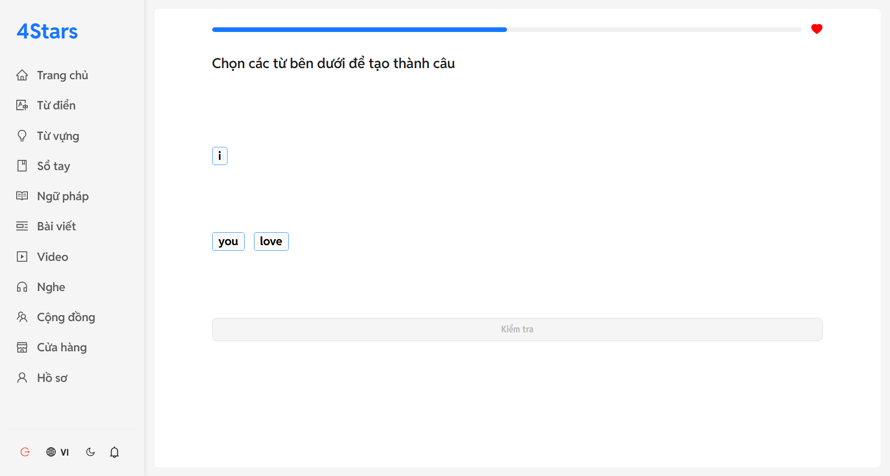
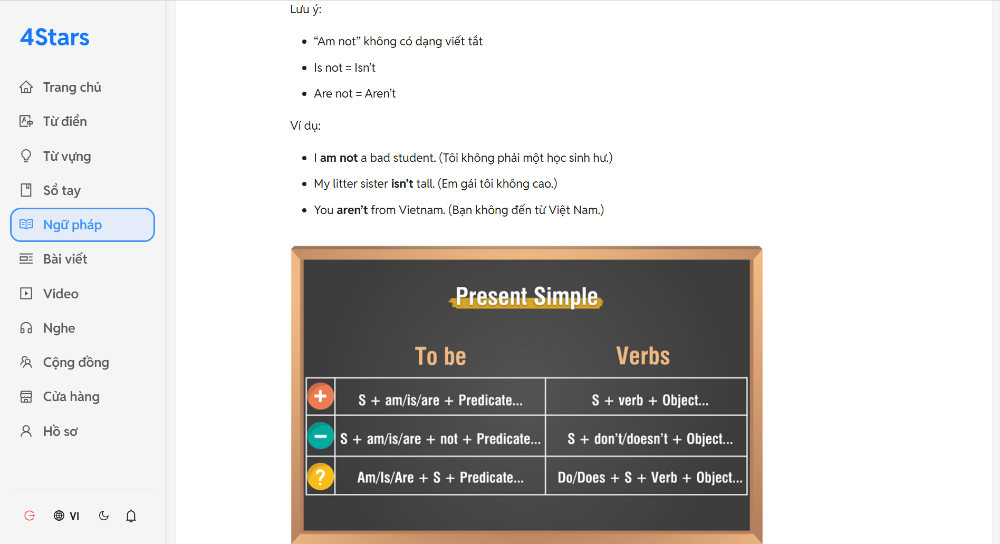
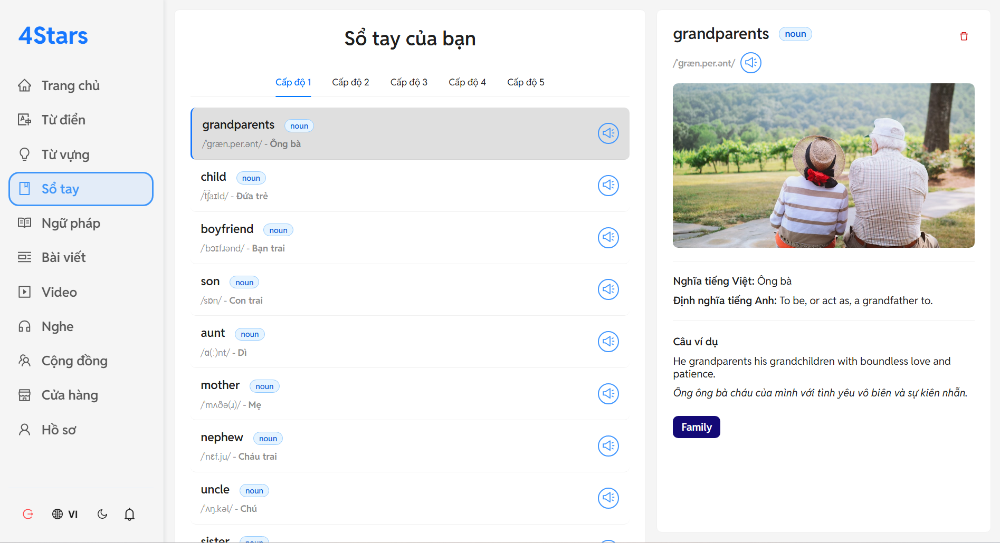
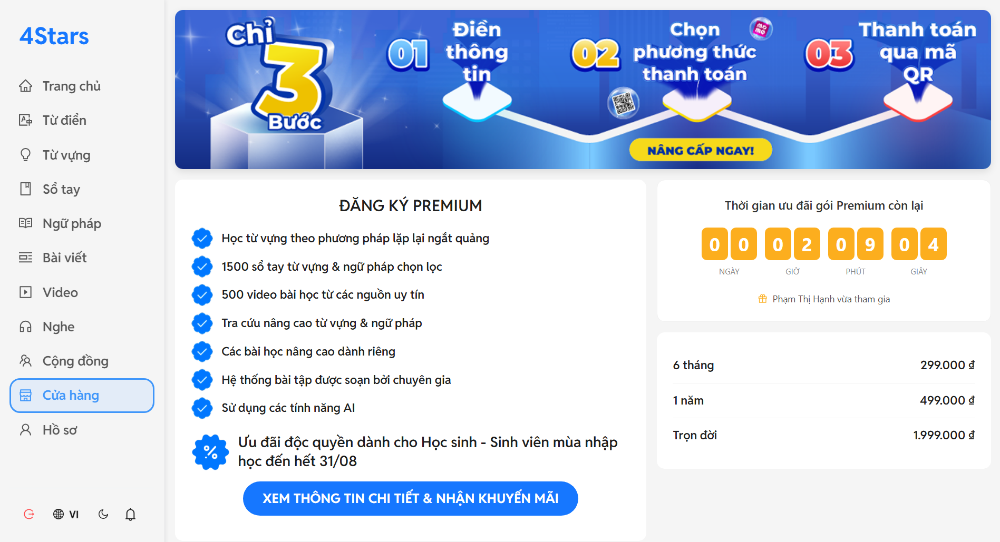

# FourStars English - Nền tảng Học Tiếng Anh Toàn diện

**4Stars English UI** 4Stars English UI là dự án frontend cho nền tảng học tiếng Anh full-stack, được xây dựng bằng React và TypeScript. Dự án tập trung vào việc cung cấp một trải nghiệm người dùng (UX) hiện đại, tương tác cao, responsive hoàn toàn và có hiệu năng vượt trội, kết nối liền mạch với hệ thống backend mạnh mẽ.


## 🔗 Liên kết Demo

> **Link trang web:** [https://fourstars.tech](https://fourstars.tech)  
> **Link tài liệu API (Swagger):** [https://fourstars.tech/swagger-ui.html](https://fourstars.tech/swagger-ui.html)

## 🚀 Tính năng Nổi bật (Features Showcase)

Dưới đây là một vài hình ảnh về các tính năng chính của ứng dụng.

<table>
  <tr>
    <td align="center"><b>Giao diện Ôn tập</b></td>
    <td align="center"><b>Giao diện Từ điển</b></td>
  </tr>
  <tr>
    <td></td>
    <td></td>
  </tr>
  <tr>
    <td align="center"><b>Trang Từ vựng</b></td>
    <td align="center"><b>Trang Quiz</b></td>
  </tr>
  <tr>
    <td></td>
    <td></td>
  </tr>
  <tr>
    <td align="center"><b>Trang Ngữ pháp</b></td>
    <td align="center"><b>Sổ tay Cá nhân</b></td>
  </tr>
    <tr>
    <td></td>
    <td></td>
  </tr>
  <tr>
    <td align="center"><b>Trang Luyện nghe</b></td>
    <td align="center"><b>Trang Video</b></td>
  </tr>
  <tr>
    <td></td>
    <td></td>
  </tr>
    <tr>
    <td align="center"><b>Trang cộng đồng</b></td>
    <td align="center"><b>Trang nâng cấp tài khoản</b></td>
  </tr>
  <tr>
    <td></td>
    <td></td>
  </tr>
</table>

## 🛠️ Công nghệ Sử dụng (Tech Stack)

| Hạng mục               | Công nghệ                                                                                                                              |
| ---------------------- | -------------------------------------------------------------------------------------------------------------------------------------- |
| **Nền tảng & Ngôn ngữ** | React 18, TypeScript, Vite                                                      |
| **Giao diện (UI)** | Ant Design 5.x, SCSS Modules, react-responsive                                                                                                         |
| **Quản lý Trạng thái** | Zustand (Global State), React Hooks                                                                                                                      |
| **Routing** | React Router DOM v6                                                                                                                               |
| **Real-time** | WebSocket, @stomp/stompjs, sockjs-client                                                                                                                     |
| **Xác thực** | @react-oauth/google                                                                          |
| **Quản lý API** | Axios                                                                                                         |
| **Đa ngôn ngữ** | i18next, react-i18next                                                                                                                    |

## ✨ Điểm nhấn

Dự án này không chỉ là một trang web thông thường mà còn là nơi áp dụng nhiều kỹ thuật và kiến trúc frontend phức tạp.


* **Kiến trúc Hiện đại & Tối ưu:**
    * Sử dụng Vite mang lại trải nghiệm phát triển siêu nhanh với Hot Module Replacement (HMR).
    * TypeScript được áp dụng triệt để trên toàn bộ dự án, đảm bảo code an toàn, dễ đọc và dễ dàng tái cấu trúc.
    * SCSS Modules giúp đóng gói style cho từng component, tránh xung đột CSS và tăng khả năng bảo trì.

* **Tương tác Thời gian thực (Real-time):**
    * Tích hợp WebSocket với STOMP.js để xây dựng các tính năng real-time phức tạp
    * Kiến trúc Context Provider: Xây dựng một WebSocketProvider để quản lý kết nối một cách tập trung, giúp các component con dễ dàng đăng ký và lắng nghe sự kiện.

* **Engine Làm bài tập (Quiz Engine) Linh hoạt:**
    * Xây dựng một component ReviewPage có khả năng render và xử lý nhiều loại câu hỏi khác nhau (trắc nghiệm ảnh/chữ, điền vào chỗ trống, nghe...).

* **Trải nghiệm Người dùng (UX) Nâng cao:**
    * Học bằng Flashcard: Giao diện học từ vựng trực quan với hiệu ứng lật 3D mượt mà.
    * Nghe chép Chính tả Tương tác: Giao diện cho phép nghe lại từng câu, kiểm tra đáp án và nhận phân tích lỗi chi tiết từ AI.
    * Tải vô hạn (Infinite Scroll): Áp dụng trong trang Cộng đồng để tải bài viết một cách mượt mà khi người dùng cuộn trang.

* **Xác thực An toàn & Hiện đại:**
    * Xử lý luồng đăng nhập/đăng xuất với JWT, tự động đính kèm token vào mỗi request API bằng Axios Interceptors.
    * Tích hợp luồng đăng nhập Google OAuth 2.0 client-side, lấy authorization_code và gửi về backend để xác thực, một phương pháp an toàn cho Single-Page Applications.

## 🌳 Hệ sinh thái Toàn bộ Dự án

Đây là project backend, là trái tim của một hệ sinh thái gồm 3 phần:

* **Backend:** https://github.com/DinhDuong1610/4stars-english-BE - Xây dựng bằng Spring Boot, chịu trách nhiệm xử lý toàn bộ logic nghiệp vụ, quản lý dữ liệu và bảo mật.
* **Frontend:**  - Xây dựng bằng React/Vite, cung cấp giao diện người dùng hiện đại, tương tác cao.
* **AI Service:** https://github.com/DinhDuong1610/4Stars-english-AI - Xây dựng bằng Python/FastAPI, chứa mô hình NLP tự train để phục vụ tính năng phân tích chính tả.

## 🚀 Bắt đầu (Getting Started)

Hướng dẫn để chạy dự án này ở môi trường local.

### Yêu cầu
* Node.js (phiên bản 18.x trở lên)
* npm hoặc yarn

### Các bước
1.  **Clone a project:**
    ```bash
    git clone https://github.com/DinhDuong1610/4Stars-english-ui.git
    cd 4Stars-english-ui
    ```
2.  **Cài đặt các dependencies:**
    ```bash
    npm install
3.  **Tạo file `.env`:**
    * Sao chép file `.env.example` thành một file mới tên là `.env`.
    * Điền các thông tin bí mật và cấu hình cần thiết của bạn vào file `.env`.
4.  **Chạy ứng dụng:**
    ```bash
    npm run dev
    ```
4.  Ứng dụng sẽ chạy tại `http://localhost:5173`.

## ✍️ Tác giả

* **Đính Dương**
* **Email:** jenny.180820@gmail.com
